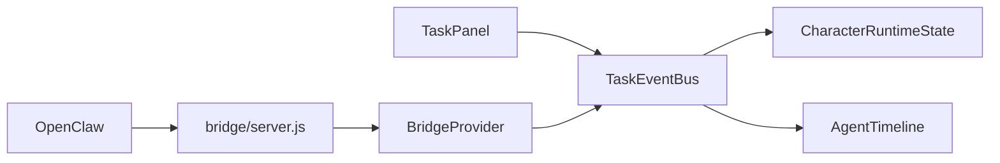

# Lemona Architecture

Lemona is a playable visualization layer for autonomous agents. The game loop is always active, and agent execution is streamed into the simulation through an event protocol.

## High-Level Components

- `src/game/*`: world rendering, NPC movement, runtime state machine.
- `src/ui/*`: in-game controls and observability panels.
- `src/agent/*`: protocol, task/event types, bridge providers.
- `bridge/*`: local adapter service for OpenClaw-compatible event translation.

## Runtime Data Flow

## Core Runtime States

NPC runtime states in `Character`:

- `idle_life`: normal campus schedule behavior.
- `moving_to_desk`: task accepted; NPC moves to work desk.
- `working`: active execution period.
- `returning_result`: NPC exits work mode and returns to life path.
- `cooldown`: short post-task period before resuming normal life.

## Design Constraints

- Keep game-side protocol agent-agnostic to avoid vendor lock.
- Keep OpenClaw-specific code in `bridge/`.
- Preserve simulation continuity even if bridge disconnects.
