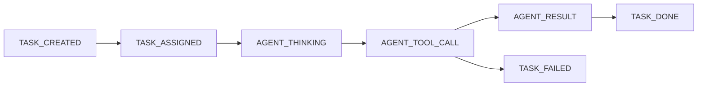

# Agent Event Protocol (v0)

Lemona consumes normalized task lifecycle events regardless of underlying agent runtime.

## Event Envelope

Every event follows this shape:

```ts
{
  id: string;
  type: AgentProtocolEventType;
  timestamp: number;
  taskId: string;
  agentId?: string;
  summary?: string;
  task?: AgentTask;
  error?: string;
}
```

## Event Types

- `TASK_CREATED`
- `TASK_ASSIGNED`
- `AGENT_THINKING`
- `AGENT_TOOL_CALL`
- `AGENT_RESULT`
- `TASK_DONE`
- `TASK_FAILED`

## Minimal Lifecycle



## Mapping to UI

- `TaskPanel`: task status and agent status chips.
- `AgentTimeline`: chronological protocol event stream.
- `Character`: state transitions and movement behavior.
